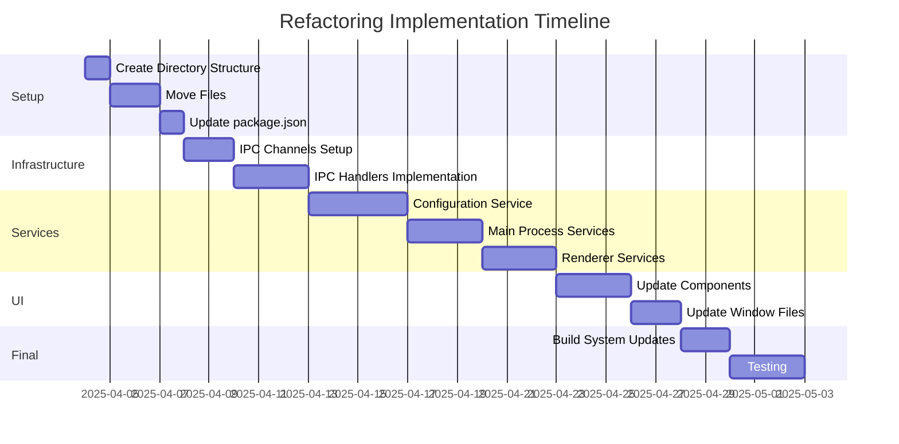

# Refactoring Plan

## Project Structure

```
src/
├── main/
│   ├── services/
│   │   ├── ConfigurationService.js
│   │   ├── IpcMainHandlers.js
│   │   └── PrintService.js
│   ├── utils/
│   │   └── FileSystemUtils.js
│   └── main.js
├── renderer/
│   ├── components/
│   │   ├── Notification/
│   │   ├── Modal/
│   │   ├── FilePicker/
│   │   ├── GradientEditor/
│   │   ├── Countdown/
│   │   └── TabSwitcher/
│   ├── services/
│   │   ├── IpcRendererService.js
│   │   ├── WebcamService.js
│   │   ├── CanonCameraService.js
│   │   ├── LocalizationService.js
│   │   └── ThemeService.js
│   ├── assets/
│   │   └── css/
│   └── utils/
├── shared/
│   ├── constants/
│   │   └── IpcChannels.js
│   └── utils/
└── windows/
    ├── launcher/
    ├── configurator/
    └── photobooth/
```

## Implementation Phases

### 1. Initial Setup Phase

- [ ] Create base directory structure
- [ ] Move files to new locations:
  - [ ] Move main.js to src/main/
  - [ ] Move configLoader.js to services/ConfigurationService.js
  - [ ] Move HTML/JS files to respective window directories
  - [ ] Move utils to appropriate locations
- [ ] Update package.json main entry point

### 2. IPC Infrastructure Phase

- [ ] Create IpcChannels.js with all channel definitions
- [ ] Implement IpcMainHandlers.js:
  - [ ] Configuration handlers
  - [ ] Window management handlers
  - [ ] Print handlers
  - [ ] File selection handlers
- [ ] Create IpcRendererService.js
- [ ] Update all IPC calls to use constants

### 3. Configuration Service Phase

- [ ] Implement ConfigurationService:
  - [ ] loadInitialConfig()
  - [ ] loadConfigForEvent()
  - [ ] saveEventConfig()
  - [ ] saveGlobalConfig()
  - [ ] Config interpolation
  - [ ] Default values handling
- [ ] Update configuration consumers

### 4. Main Process Reorganization

- [ ] Split main.js functionality:
  - [ ] Window management
  - [ ] Canon camera control
  - [ ] App state management
  - [ ] Error handling
- [ ] Implement process monitoring
- [ ] Add comprehensive logging

### 5. Renderer Updates

- [ ] Update HTML files with new paths
- [ ] Create base components
- [ ] Update window JS files
- [ ] Implement renderer services

### 6. Build System Updates

- [ ] Update build configuration
- [ ] Configure resource handling
- [ ] Update dependencies

### 7. Testing & Verification

- [ ] File paths testing
- [ ] IPC communication testing
- [ ] Configuration verification
- [ ] Window management testing
- [ ] Camera integration testing
- [ ] UI functionality verification

## Dependencies Between Tasks



## Rollback Plan

1. Create backup of current files
2. Document all file moves
3. Keep old structure until new one is verified
4. Test each phase before proceeding
5. Have parallel development setup
